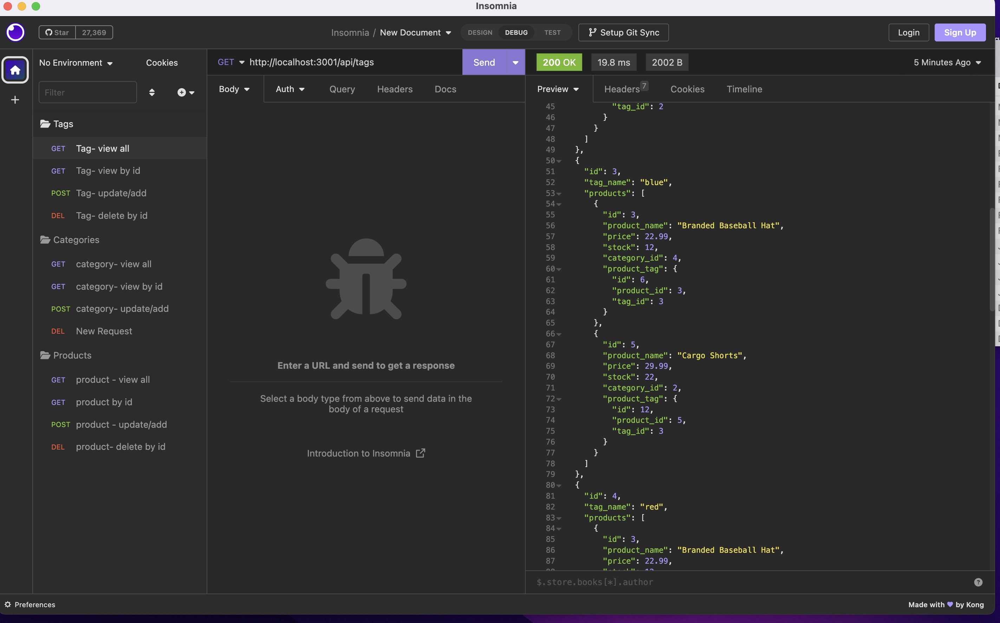

# ecommerce-backend
Ecommerce Back End using ORM

## Description of the task

Internet retail, also known as **e-commerce**, is the largest sector of the electronics industry, generating an estimated $29 trillion in 2019. E-commerce platforms like Shopify and WooCommerce provide a suite of services to businesses of all sizes. Due to their prevalence, understanding the fundamental architecture of these platforms will benefit you as a full-stack web developer.

The task was to build the back end for an e-commerce site by modifying starter code. You’ll configure a working Express.js API to use Sequelize to interact with a MySQL database.

## User Story

```md
AS A manager at an internet retail company
I WANT a back end for my e-commerce website that uses the latest technologies
SO THAT my company can compete with other e-commerce companies
```

## Acceptance Criteria

```md
GIVEN a functional Express.js API
WHEN I add my database name, MySQL username, and MySQL password to an environment variable file
THEN I am able to connect to a database using Sequelize
WHEN I enter schema and seed commands
THEN a development database is created and is seeded with test data
WHEN I enter the command to invoke the application
THEN my server is started and the Sequelize models are synced to the MySQL database
WHEN I open API GET routes in Insomnia for categories, products, or tags
THEN the data for each of these routes is displayed in a formatted JSON
WHEN I test API POST, PUT, and DELETE routes in Insomnia
THEN I am able to successfully create, update, and delete data in my database
```

## Installation

N/A

## Usage

By the completion of this back-end developement, you can easily view all section(s), delete or add to the related sections of the ecommerce.

## screenshot of the page

 
"Ecommerce Back-end")

## Video URL 

https://drive.google.com/file/d/11jFx7WlkhBWvra7S1FbniOvWLI81iSXR/view .It is also attached in the repo within assets folder.

## URL of Github Repository
Repo URL: https://najiba-haidari.github.io/ecommerce-backend/ 

## Credits

N/A

## License

Please refer to the LICENSE in the repo.